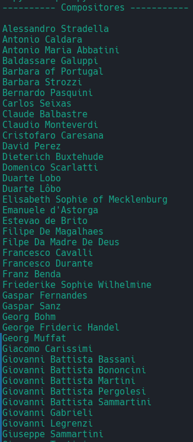
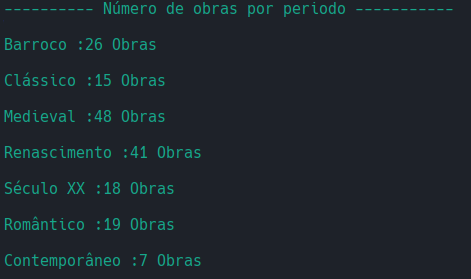
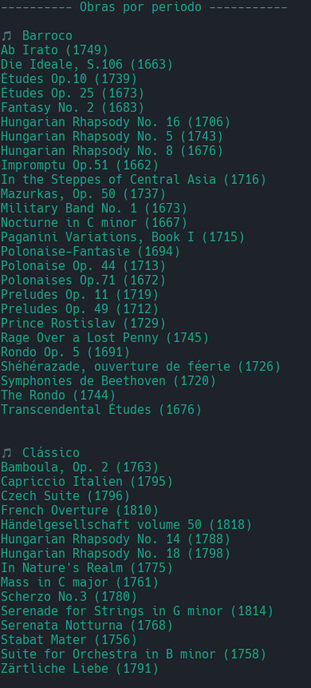

# 🎵 TPC2 - Análise de um Dataset 🎵

2025-02-14

## Autor 🧑‍💻 
**Nome:** Afonso Gonçalves Pedreira  
**Número:** A104537  
**Curso:** Software Engineering  
**Ano:** 2024/2025  

## Descrição do problema

Neste TPC, é proibido usar o módulo CSV do Python. Deverás ler o dataset, processá-lo e criar os seguintes resultados:
1. 📜 Lista ordenada alfabeticamente dos compositores musicais;
2. 📊 Distribuição das obras por período: quantas obras catalogadas em cada período;
3. 📚 Dicionário em que a cada período está associada uma lista alfabética dos títulos das obras desse período.

### Regras:
- 🚫 **Proibido usar o módulo CSV do Python**: O processamento do CSV deve ser feito manualmente.
- 🔤 **Ordenação**: A ordenação deve respeitar os acentos e caracteres especiais.

### Implementação:
1. 📥 **Leitura do CSV**: O programa lê o arquivo CSV linha por linha, acumulando as linhas em um buffer até que uma linha completa seja formada. 
2. ✂️ **Divisão dos Campos**: A função `split_campos` é usada para dividir a linha em campos, respeitando as aspas e os delimitadores. Se a linha começar com aspas e não terminar com aspas, o código continua acumulando linhas até encontrar uma linha que termine com aspas.
3. 🔄 **Inversão dos Nomes dos Compositores**: A função `inverter_nome` verifica se o nome do compositor contém uma vírgula. Se contiver, ela inverte o nome para o formato "Nome Sobrenome".
4. 🔤 **Ordenação dos Compositores**: A função `lista_compositores_ordered_alphabetically` cria uma lista de compositores com os nomes invertidos quando necessário, ordena essa lista alfabeticamente e imprime os nomes dos compositores ordenados.
5. 📚 **Distribuição das Obras por Período**: A função `lista_obras_por_periodo` cria um dicionário onde cada período está associado a uma lista de obras. As obras são ordenadas pelo nome dentro de cada período.

## Instruções de utilização

1. O arquivo de entrada deve estar na mesma pasta que o script.
2. Executar o script:

```sh
$ python tpc2.py < obras.csv
```

## Resultados

### 📜 Lista ordenada alfabeticamente dos compositores musicais
O programa gera uma lista ordenada alfabeticamente dos compositores musicais, respeitando os acentos e caracteres especiais.


### 📊 Distribuição das obras por período
O programa calcula a distribuição das obras por período, mostrando quantas obras estão catalogadas em cada período.


### 📚 Dicionário de obras por período
O programa cria um dicionário onde cada período está associado a uma lista alfabética dos títulos das obras desse período.


